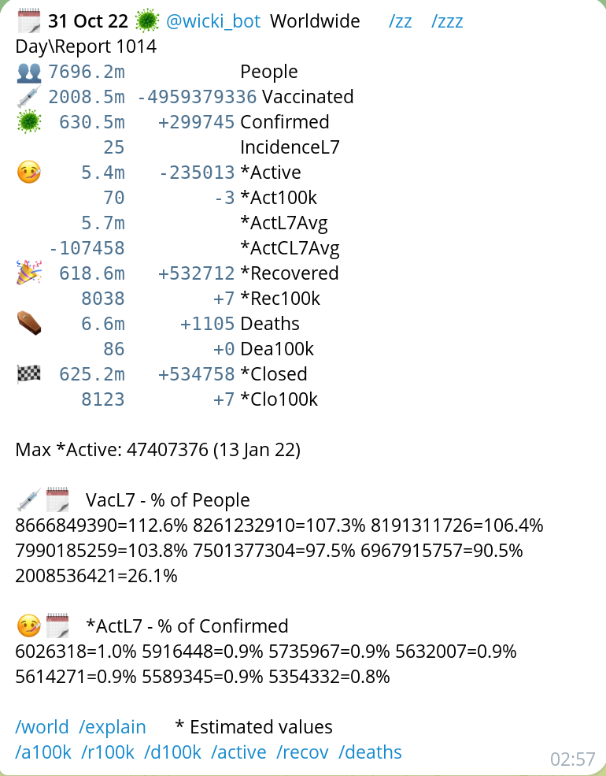
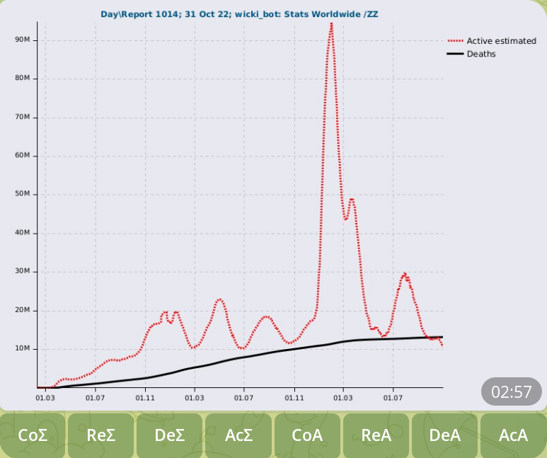
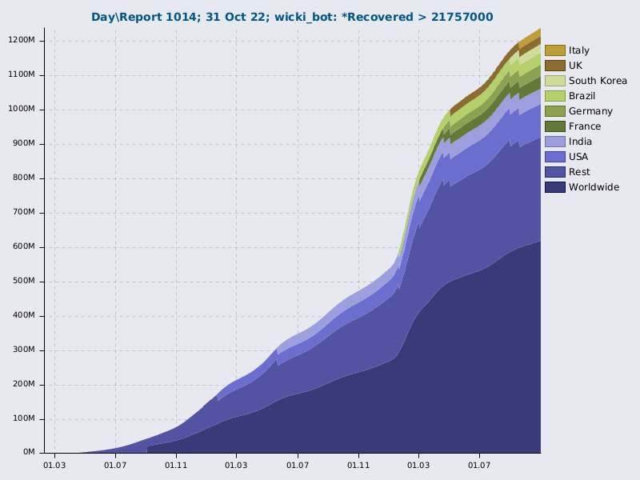
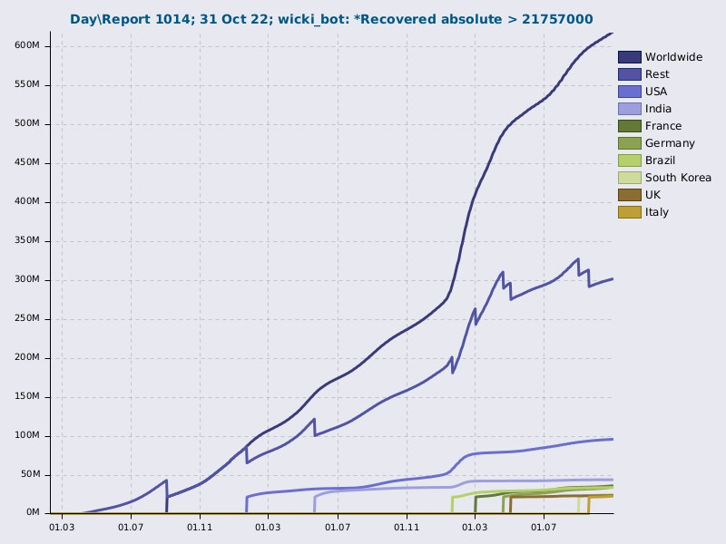

Coronavirus disease 2019 (COVID-19) information on Telegram Messenger
[@corona_cases_bot](https://t.me/corona_cases_bot)

## Raison d´être
> The Internet interprets censorship as damage and routes around it.
> - John Gilmore






<!-- TODO add monkeypox data: https://github.com/globaldothealth/monkeypox -->

## Setup environment

### Install
* Java on GuixOS: `guix install openjdk:jdk`. Thanks to [awb99](https://github.com/clojure-emacs/orchard/issues/117#issuecomment-859987280)
* [Clojure](https://clojure.org/guides/getting_started#_clojure_installer_and_cli_tools)
* [Heroku for Clojure](https://devcenter.heroku.com/articles/getting-started-with-clojure)
```bash
# on Ubuntu:
# The `sudo snap install heroku --classic` doesn't work on Ubuntu
# See https://github.com/heroku/cli/issues/822
curl https://cli-assets.heroku.com/install.sh | sh

# on Guix:
npm install -g heroku
sudo rm /usr/local/bin/heroku
sudo ln -s /home/bost/.npm-packages/bin/heroku /usr/local/bin/heroku
```
* [Babashka](https://github.com/babashka/babashka#installer-script)
* postgresql:
```bash
## on Ubuntu:
sudo apt install --yes postgresql postgresql-contrib
# TODO: see the the proposition given by the installation process:
# You can now start the database server using:
#     pg_ctlcluster 13 main start
sudo systemctl status postgresql.service
sudo systemctl stop postgresql.service
pgdata=./var/pg/data
pglog=./var/log/postgres.log
mkdir -p $pgdata
sudo chmod --recursive u=rwx,g=rwx,o=rwx ./var/
sudo --shell --user=postgres
# when using fish shell:
set --export PATH /usr/lib/postgresql/*/bin $PATH
initdb $pgdata # dropdb postgres && rm -rf $pgdata
pg_ctl --pgdata=$pgdata --log=$pglog start
# see also: postgres --pgdata=$pgdata &

## on Guix:
pg_ctl --pgdata=$pgdata --log=$pglog start
```
Open new console and log in
```bash
# in case of:
#      psql: error: FATAL:  role "username" does not exist
#   sudo --user=postgres createuser -s <username>
# or:
#   createuser --shell postgres # on guix
psql --dbname=postgres # or:
# sudo -u postgres psql --dbname=postgres
```
```postgres
\conninfo
-- list databases:
\l
\l+
SELECT datname FROM pg_database;
```

### Create
* [Telegram Chatbot](https://core.telegram.org/bots#3-how-do-i-create-a-bot)
* [Heroku App](https://www.heroku.com/), optionally add the Papertrail add-on

### Define local environment vars
Create `.env` in the project root directory and set the `CLOJURE_CLI_VERSION`:
```bash
echo \
"# See also .custom.env

# The value must be one of `(keys corona.envdef/environment)`;
# lower-cased and not surrounded by the double quote chars \"\".
CORONA_ENV_TYPE=hokuspokus
# (keyword corona-cases)
# (keyword hokuspokus)
# (keyword \"local\")
# kdevel

# https://clojure.org/guides/getting_started#_installation_on_linux
CLOJURE_CLI_VERSION=0.0.0.0

PAPERTRAIL_API_TOKEN=\$PAPERTRAIL_API_TOKEN_HOKUSPOKUS
TELEGRAM_TOKEN=\$TELEGRAM_TOKEN_HOKUSPOKUS

# PAPERTRAIL_API_TOKEN=\$PAPERTRAIL_API_TOKEN_CORONA_CASES
# TELEGRAM_TOKEN=\$TELEGRAM_TOKEN_CORONA_CASES" > .env
heroku_clj updateClojureCliVersion
```
* Define Heroku config vars
See [https://dashboard.heroku.com/apps/\<HEROKU-APP-NAME\>/settings]().
It should contain:
```bash
heroku config --app <HEROKU-APP-NAME>
CLOJURE_CLI_VERSION:  ...
COMMIT:               ...
CORONA_ENV_TYPE:      ...
PAPERTRAIL_API_TOKEN: ...
REPL_PASSWORD:        ...
REPL_USER:            ...
TELEGRAM_TOKEN:       ...
```

## Develop

1. Get the test data and start the mockup data service
Initially, copy the whole project to a separate directory:
```bash
cd ..
cp -r corona_cases/ corona_cases.data
cd corona_cases.data
```
1. Repeatedly
```bash
heroku_clj getMockData
clj -X:mockup-server
```

1. Start the nREPL from the command line:
<!-- No line continuations '\' accepted -->
```bash
clojure -Sdeps '{:deps {nrepl/nrepl {:mvn/version "0.9.0"} refactor-nrepl/refactor-nrepl {:mvn/version "3.5.5"} cider/cider-nrepl {:mvn/version "0.28.3"}}}' -m nrepl.cmdline --middleware '["refactor-nrepl.middleware/wrap-refactor", "cider.nrepl/cider-middleware"]'
```
Then in Emacs `M-x cider-connect-clj`

1. Start the telegram chatbot long-polling:
```clojure
(require '[corona.telegram])
(corona.telegram/start)
```

1. Start the web server:
```clojure
(require '[corona.web])
(alter-var-root #'system component/start)
```
and check the [http://localhost:5050/](http://localhost:5050/) if it's running.

## Run locally

On PostgreSQL 13.3 no var/pg/postgresql.conf changes needed.

On PostgreSQL 13.6, in the var/pg/postgresql.conf:
1. activate:
```
unix_socket_directories = '/tmp'  # comma-separated list of directories
```
1. comment out:
```
# lc_messages = 'en_US.utf8'			# locale for system error message
# 					# strings
# lc_monetary = 'en_US.utf8'			# locale for monetary formatting
# lc_numeric = 'en_US.utf8'			# locale for number formatting
# lc_time = 'en_US.utf8'				# locale for time formatting
```

```bash
# start Postgres
pg_ctl --pgdata=./var/pg --log=./var/log/postgres.log start # on Guix
# pg_ctl --pgdata=./var/pg stop
bin/build && heroku local --env=.custom.env
# or:
# bin/build && heroku local --env=.custom.env --set COMMIT=...
```

## Heroku CI pipeline
```bash
heroku_clj deploy --heroku-env hokuspokus
# heroku_clj promote
```

## MySQL -> PostgreSQL script conversion

```bash
sudo apt install postgresql postgresql-contrib
# Switch over to the postgres account:
sudo su postgres
createdb postgres # or: dropdb postgres

# psql --dbname=postgres         --echo-all --file=dbase/my.sql | rg "ERROR\|NOTICE|WARN"
# psql --dbname=postgres --quiet            --file=dbase/drop-everything.sql
psql --dbname=postgres   --quiet            --file=dbase/my.sql

# get the psql prompt:
psql --dbname=postgres
```

then
```postgres
-- help
\?
-- list roles / show users
\du
-- list tables
\dt
-- list sequences
\ds
-- list indices
\di
```

## Update
```bash
heroku_clj updateClojureCliVersion
# like `lein ancient`
# see also https://github.com/practicalli/clojure-deps-edn
# clojure -Spom # generate the pom.xml
clojure -M:outdated --upgrade # --force
```

## Others

```bash
# Inspect logfile:
# heroku plugins:install heroku-papertrail
heroku pt ":type -'ssl-client-cert' -'$MY_TELEGRAM_ID'" --app <HEROKU-APP-NAME> | grep -v -e '^[[:space:]]*$

# Inspect memory:
# sudo apt install visualvm
visualvm -J-DsocksProxyHost=localhost -J-DsocksProxyPort=1080 & disown

# get command line access
# Note: it reads the .bashrc and/or .bash_profile HUH!
heroku run bash --app <HEROKU-APP-NAME>

# postgres database command line
heroku pg:psql --app <HEROKU-APP-NAME> <DATABASE>
```
